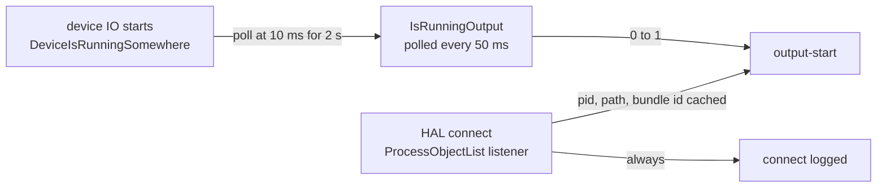

# audiowatch

Names the process that just put audio on one of this Mac's outputs.

* **Short-lived ones too**: a process that starts, plays and exits in a fraction of a second.
* **Silent itself**: it never plays anything.

It also **records**: any channel, or pair of channels, of any audio device to a WAV file, for an agent over MCP or from the command line. See [Recording](#recording).

## Run it

```sh
cargo build --release
./target/release/audiowatch
```

* Watches until you stop it.
* Prints events.
* Posts a notification for anything not on the allow-list.

### Running it all the time

```sh
./target/release/audiowatch --install-agent   # writes the LaunchAgent, prints the command
```

* **It does not load the agent.** Deliberately.
  * It prints the `launchctl bootstrap` line for you to run.
* **Copy the binary somewhere stable first**, such as `/usr/local/bin`.
  * The plist points at wherever the binary was when you ran the command.

## Everything else it does

```sh
audiowatch --tail            # the last 20 sound events
audiowatch --tail 100 -f     # ... and keep printing new ones
audiowatch --since 1h        # what made sound in the last hour
audiowatch --since 2026-09-26T11:00
audiowatch --all --tail      # include the connect/disconnect chatter
audiowatch --now             # what is making sound at this instant
audiowatch --devices         # devices and their channel counts
audiowatch --test-notify     # post a notification and verify it arrived
audiowatch --paths           # where the config and log are
audiowatch --mcp             # serve the recorder over MCP (see Recording)
audiowatch rec list          # devices, and what can be recorded from each
```

## Where things live

| | |
|---|---|
| log | `~/Library/Logs/audiowatch/audiowatch.log` |
| config | `~/.config/audiowatch/config.conf` |
| agent | `~/Library/LaunchAgents/local.audiowatch.plist` |

### The log

* **The log is the primary output.**
* Each line is written and `fsync`ed **before** the notification is attempted.
  * A missed, dismissed or suppressed notification never loses the record.
* **Format**: tab-separated, backslash-escaped, one line per event.

```
epoch_ms  local_time  kind  disposition  pid  bundle  exe  devices  note
```

* **`kind`**: one of `connect`, `output-start`, `output-stop`, `input-start`, `input-stop`, `disconnect`, `baseline`.
* **Rotation**: to `audiowatch.log.1` at 8 MB.

## Stopping something from notifying you

Add one line to `~/.config/audiowatch/config.conf`:

```
allow-exe    afplay                      # match the executable's file name
allow-path   /Applications/Thing.app/*   # match the full executable path
allow-bundle com.example.thing           # match the bundle id
```

* Patterns are case-insensitive.
  * `*` matches anything. `?` matches one character.
* Running as an agent? Restart it: `launchctl kickstart -k gui/$(id -u)/local.audiowatch`.

### Allowed is not hidden

**An allow-listed event is still logged**, with the rule that suppressed it. You can always go back and see what was hidden:

```
11:43:30  output-start  Discord Helper  pid 81645  dev[Speakers] (allowed by path /Applications/Discord.app/*)
```

### The default list

* **Covers**: Chrome, Safari, Firefox, Arc, Brave, Edge, Spotify, Music, TV, Podcasts, QuickTime, VLC, IINA, Zoom, Slack, Discord, Teams, FaceTime, Messages and WhatsApp.
* Matched on bundle id *and* on path.
  * A helper process usually has a path and no bundle id.
* The config file lists them all, with comments.
  * It is the same text that ships as the defaults.

## How it detects the start of output

Three CoreAudio facts. Each was measured on this machine (macOS 26.6.2), not taken from documentation.

| API | Sends notifications? |
|---|---|
| `kAudioHardwarePropertyProcessObjectList` | **yes**, within ~1 ms of a process connecting to the HAL |
| `kAudioDevicePropertyDeviceIsRunningSomewhere` | **yes**, when IO starts on a device. It cannot say which process |
| `kAudioProcessPropertyIsRunningOutput` | **no.** A listener registers successfully (`status 0`) and then never fires |

**No single API answers the question.** So the tool combines all three:



1. **Identity is captured at the HAL connect**, by the process object list listener.
   * A process connects *before* it makes a sound: measured at 112–220 ms before.
   * It is **necessarily** still alive at that moment.
   * So its pid, executable path and bundle id are read and cached right then.
   * That is what lets an `output-start` name a process that has since exited.
2. **`IsRunningOutput` is polled** every 50 ms, because it does not notify.
   * This is what actually detects output starting.
3. **A device reporting IO** drops the poll to 10 ms for 2 seconds.
   * That pins down which process was responsible.
4. **Every HAL connect is logged**, even if output is never confirmed.
   * A process cannot make a sound without connecting first. This is the backstop.
   * Worst case: "`/usr/bin/afplay` connected at 11:43:32.340 and was gone 214 ms later". Still the clue you needed.

### Notifications

* Posted through `osascript`'s `display notification`.
  * Needs no app bundle of our own.
  * Works from a LaunchAgent.
* ✅ **Verified** by posting one: `usernoted` logged the presentation 130 ms later.
* They carry **no sound**.
* `audiowatch --test-notify` repeats that check.
  * If it fails, it points you at System Settings → Notifications → **Script Editor**.
  * That is the app notifications are attributed to.

### What it costs

* Measured on this machine: **0.7% of one core and 13 MB resident**, at the default 50 ms poll.
* An idle tick is two property reads per audio process. Nothing else.
* Identity and device lookups happen only when a flag actually moves.
  * That is what keeps a permanently-resident watcher cheap.

## What still gets past it

⚠️ Read this before trusting it.

* **A process that holds an output stream open permanently.**
  * Detection is on the *transition* of `IsRunningOutput` from 0 to 1.
  * Open at login, kept open, mostly silence, occasionally audible: it never transitions and is never reported.
  * On this machine `arkaudiod` (Audio Routing Kit) is exactly this shape.
    * Permanently running output on MacBook Pro Speakers, both BlackHole devices and the LG display.
  * **If the noise arrives through ARK, Loopback, BlackHole or JACK, audiowatch will attribute it to the bridge, or not see it at all.**
  * These are deliberately *not* on the default allow-list.
  * The lever: a process tap, below.
* **Sounds played on another process's behalf.**
  * `systemsoundserverd` plays UI and alert sounds for other apps.
  * You see `systemsoundserverd`, not whoever asked.
  * Same for `PowerChime` (the charger sound) and `audiomxd`.
* **Anything that is not a HAL client process at all.**
  * The boot chime, which is firmware.
  * Audio generated inside a HAL plug-in driver rather than by a client.
* **Which channels.**
  * CoreAudio's per-process API reports the *devices* a process is running on.
  * It has no per-channel attribution.
  * So audiowatch names the device, and `--devices` gives its channel count.
  * It cannot say "channels 3–4 of the Scarlett".
* **A gap shorter than the poll.**
  * An output stream open for less than 50 ms **possibly** falls between two polls.
  * In practice the window is far longer than the sound: a process opens the device, plays, and lingers.
  * Across 13 measured `afplay` runs of 100–500 ms files, the shortest output window was **524 ms**.
    * Ten times the poll interval.
  * Want more margin? Lower `poll-ms`.
* **A device something else already holds.**
  * `DeviceIsRunningSomewhere` is a per-device flag, not a per-process one.
  * When `arkaudiod` already has MacBook Pro Speakers running, a second process starting output there changes nothing.
    * No notification arrives.
  * On this machine several devices are permanently running.
  * **So the poll is the real detector. The device listener is only an accelerator.**
  * Do not raise `poll-ms` far on the assumption that the listener will cover it.
* **A process that exits before its path can be read.**
  * The pid and bundle id are still logged.
  * The note says the path was never readable.

### The escalation: a process tap

* If the watcher comes up empty, the next step is a **process tap**.
  * `kAudioTapClassID` / `CATapDescription`, in the same headers.
* It measures the actual signal a process produces, not whether it is running IO.
* So it would see audio passing through a permanently-open stream.
  * That is the gap above that matters most.
* Started, not finished: see [Status](#status-done-2026-09-26).

## Layout

| | |
|---|---|
| `src/sys.rs` | CoreAudio / libproc / libc declarations, checked against the SDK headers |
| `src/hal.rs` | HAL queries, behind the `HalView` trait |
| `src/reconcile.rs` | the state machine: HAL snapshot in, events out. Pure, so it is tested against a fake HAL |
| `src/watch.rs` | listeners, the poll loop, and what to do with an event |
| `src/event.rs` | the log record and its encoding |
| `src/filter.rs` | the allow-list and its glob matching |
| `src/config.rs` | the config file; `src/default_config.conf` is both the docs and the defaults |
| `src/logfile.rs` | append-only writer, reader and `--since` / `--tail` |
| `src/notify.rs` | notifications, and checking they arrived |
| `src/agent.rs` | the LaunchAgent plist |
| `src/rec/` | the recorder's MCP server (`audiowatch --mcp`) and its command line (`audiowatch rec`) |
| `crates/audiowatch-record` | the recorder: take specs, which device records in which direction, the writer thread, sessions and the host-time window |
| `crates/audiowatch-clock` | recording in time with a MIDI clock: the downbeats, the tempo, the MIDI input (feature `midi-clock`) |
| `crates/simply-*` | device enumeration, MIDI clock messages, and the trait the MCP tools are derived from |

* **The watcher has no dependencies.**
  * It reaches CoreAudio, libproc and libc through the declarations in `src/sys.rs`.
  * Its modules use none of the crates in `Cargo.toml`.
* **The recorder has some**: `cpal` for devices, `hound` and `rtrb` to write, `midir` for the clock, `rmcp`, `axum` and `tokio` to serve.
* `cargo test --workspace` covers the encoding, the filter rules, the log reader, the CLI and the time parsing.
  * Also the whole state machine, including the short-lived-process case.
  * Also the recorder: take specs, routing, the trim to a window, the clock timeline, and the MCP surface over a real socket.
* The CoreAudio callbacks are covered by hand, as described above.
* Two tests open a real device and are ignored in the gate; see [Recording](#recording).

## The process tree

* **`afplay` on its own is meaningless.** Half the machine plays a sound that way.
* **`afplay ← zsh ← claude` is the whole answer.**
* So every record carries the chain above the process.
* It is walked **when the process connects to the HAL**, not when its output is noticed.
  * A process connects 113–321 ms before it makes a sound.
  * By the time a 200 ms burst is seen, its parents can be gone too.

```
12:10:39  output-start  afplay   pid 87533  ← zsh ← claude  dev[Speakers]
```

* Nearest ancestor first, stopping at `launchd`.
* Depth-capped at 12, with a cycle guard.
* **The short form shows three.**
  * The log line carries the whole chain, with every path.
  * `--now` prints all of it.

### `allow-ancestor`

The filter can match **any ancestor**, by file name or by path:

```conf
allow-ancestor claude          # anything my agent sessions spawn
allow-ancestor /opt/homebrew/* # or by where it lives
```

* **This rule is what makes the watcher useful.**
* `afplay` is how everything plays a sound.
  * Excusing `afplay` would hide everything, including the noise you built this to find.
  * Excusing *what started it* does not.
* An ancestor whose path could not be read matches no rule.
  * A bare pid is not an identity to trust a rule against.

## Status: done (2026-09-26)

Chris: *"audiowatch can be considered done."*

* ✅ **Done**: the detector, the log, the filter, the notifications and the process tree.
  * Finished, gated and installed at `~/.local/bin/audiowatch`.
* **Nothing is running.**
  * The LaunchAgent is written and **not loaded**.
  * It does nothing until you bootstrap it.

```sh
launchctl bootstrap gui/$(id -u) ~/Library/LaunchAgents/local.audiowatch.plist
launchctl bootout   gui/$(id -u)/local.audiowatch    # and to stop it
```

### Not yet constructed: the process tap

* **The process tap was started and is not finished.**
* `src/tap.rs` and `src/bridge.rs` are in the tree.
  * Unreferenced, marked `#[allow(dead_code)]` item by item.
* They are the escalation described in [What still gets past it](#what-still-gets-past-it).
* They would see audio passing through a **permanently open** stream.
  * The one failure mode this tool cannot detect.
  * The shape `arkaudiod` has on this machine.
* Nothing else depends on them.
* Kept rather than deleted, so that route is a resumption, not a rewrite.

## Recording

`audiowatch` records channels of this Mac's audio devices to 32-bit float WAV.

* **For an agent first.** Non-interactive, and every recording has a length fixed at the start.
* **Paths, never audio.** An answer names each file by absolute path. It never carries the audio.
* **Never plays anything.** It opens no output stream and sends nothing to any MIDI port.

### Reach it

| surface | how | use when |
|---|---|---|
| MCP | `audiowatch --mcp [--port 3929] [--dir DIR]`, endpoint `http://127.0.0.1:3929/mcp` | the normal case |
| shell | `audiowatch rec list --json`, `audiowatch rec clocks`, `audiowatch rec record --seconds N --json TAKE...`, `audiowatch rec record --bars N [--beats-per-bar B] [--clock PORT] TAKE...` | no MCP client, or a skill that runs commands |

```sh
cargo build --release
./target/release/audiowatch --mcp
claude mcp add --transport http audiowatch http://127.0.0.1:3929/mcp
```

* **Files go in `~/Music/audio-rec/`**
  * unless the server was started with `--dir`, the call passes `dir`, or a take names its own `=PATH.wav`.
* Generated names say what they hold: `zoom-l6max-in-13-14-<unix-seconds>.wav`.

### The rule: paths, never audio

* An answer names each take's file by **absolute path**.
  * A text line, and on MCP a `resource_link` with a `file://` URI and `audio/wav`.
* It never carries the audio: no base64, no audio or embedded-resource blocks. **No levels either.**
  * Pass the path to whatever measures or plays it.
* A path is only returned once its file is finished and closed.
  * One exception, which says so: `wait: false`, below.

### Tools

* **`list_devices`**: call first.
  * Every device, both sides, channel counts, current rate, the stereo pairs, `record_in` / `record_out`.
  * A note on every refused direction saying what to do instead.
* **`record(takes, seconds | bars, beats_per_bar?, clock?, dir?, wait?)`**
  * Records for a length fixed at the start: `seconds`, or `bars` of a MIDI clock (below).
  * Waiting (the default) it blocks, at most **50 s**, and returns finished files.
  * There is no stop verb and no open-ended recording.
* **`await_recording(id)`**: collects a `wait: false` recording; see below.

### Takes

A take is `DEVICE:in|out:CHANNELS[=PATH.wav]`.

* **`DEVICE`**: the exact name from `list_devices`, or an unambiguous fragment of it.
* **`in`**: what arrives at the device. A mixer's or interface's inputs, a microphone, a virtual device's return.
* **`out`**: what the computer sends to the device.
  * Only devices with **no input side** (built-in speakers, displays) can be tapped, on macOS 14.2+.
* **`CHANNELS`**: one channel (`3`, a mono file) or an adjacent pair (`3-4`, stereo), counting from 1.
* **Takes in one call start together.**
  * Each is its own stream and its own 32-bit float file, at its device's own rate.
  * Never resampled, never mixed. Two devices are two clocks, which is why they are two files.
* **Read `warnings`.** Each names its take:
  * audio **dropped** (the writer fell behind, the file has gaps: record it again);
  * no audio arrived;
  * a stream error.

### Recipe: record while something else plays

An agent is bad at real time, so never "start, then stop when it sounds done".

1. `record(takes: ["BlackHole 16ch:in:1-2"], seconds: 20, wait: false)`
   * Returns at once with an `id` and the paths the files **will** have.
   * They are **not readable yet**.
2. Make the sound: start the synth, the render, the transport.
3. `await_recording(id)`
   * Returns once the files are finished, exactly as a waiting `record` would.
   * It sends progress while it waits. If the client times out anyway, call it again: the result is kept until collected.
   * At most 8 uncollected recordings are kept. The oldest finished one is dropped to make room; its files stay on disk.
   * `wait: false` allows up to **600 s**.

### Recipe: record N bars in time with a MIDI clock

When something on the desk sends MIDI clock (a drum machine, a groovebox, a DAW), `record(takes, bars: 4)` lands every take on the clock's **next downbeat** and ends it **4 bars later, counted in clock ticks**. A tempo change mid-take still ends on the bar.

* **Which clock**: the one MIDI input that is sending clock (`0xF8`).
  * Several: refused, naming them with their tempos. Pass `clock: "<port>"`.
  * None: refused, naming every input.
  * A master that sends clock only while playing is silent at arm time: name its port and use `wait: false`.
  * `audiowatch rec clocks` lists the MIDI inputs and which are ticking.
* **Where the bar is**: MIDI clock carries ticks, not bars.
  * The bar is counted from the clock's `Start` (or `Song Position` + `Continue`).
  * A clock that was **already running** when the take armed has no bar, so the take **waits for the next Start**.
  * Ask the person to stop and start the master (or arm, then press play).
  * `beats_per_bar` (default 4) is the one thing the clock cannot say.
* **The answer** carries, beside the paths:
  * `clock.tempo_bpm`, the mean over the take from the ticks, with the slowest and fastest beat;
  * `clock.start_bar`;
  * `clock.bars`: fewer than asked if the clock stopped, jumped or went silent, and a warning names which;
  * per take, `sync.trimmed_frames` (pre-roll cut off) and `sync.offset_frames` (the first frame against the exact downbeat, within ±0.5).
* **Caps**
  * A waiting call needs the tempo (the clock must be ticking), and the bars plus a bar's wait plus 2 s must fit in 50 s. Otherwise `wait: false`.
  * With `wait: false` the bars must fit in 600 s, and it waits up to 120 s for the downbeat.
* **How it lands**
  * Audio runs from the moment the call arrives, into a `.part.wav` beside the final path.
  * The downbeat is a least-squares fit through the ticks half a beat either side of it, averaging MIDI's arrival jitter.
  * It is mapped to a frame through each buffer's capture time. Both are on macOS's host clock.
  * The file is trimmed to it. macOS only.
* **It is a build feature**, `midi-clock`, on by default.
  * `cargo build --release --no-default-features` builds a recorder with no MIDI at all.
  * That build refuses `bars`, `clocks` and `--bars` by name, and records by seconds.

### What can be recorded on this machine

Measured with `audiowatch rec list`, 2026-09-27.

* **`out` is a CoreAudio tap**, and cpal builds one only for a device with no input side (macOS 14.2+).
* The rule is in `crates/audiowatch-record/src/catalog.rs` and its tests.

| device | channels in / out | `in` | `out` | lever for 🚫 |
|---|---|---|---|---|
| ZOOM L6max (the mixer) | 14 / 4 | ✅ pairs 1-2 … 13-14 | 🚫 | has an input side, so it cannot be tapped: send its bus to BlackHole or Loopback as well and record that `in` |
| Scarlett 4i4 USB | 6 / 4 | ✅ 1-2, 3-4, 5-6 | 🚫 | same: route through BlackHole or Loopback |
| BlackHole 16ch | 16 / 16 | ✅ pairs 1-2 … 15-16 | | not needed: what is sent to it comes back on its input, so record it `in` |
| BlackHole 2ch | 2 / 2 | ✅ 1-2 | | same as BlackHole 16ch |
| Loopback devices: Stream, Spotify, Chrome, DAWless | 2 / 0 | ✅ 1-2 | | input-only already |
| Loopback device: Speakers | 2 / 2 | ✅ 1-2 | | record it `in` |
| MacBook Pro Speakers | 0 / 2 | | ✅ tap | |
| MacBook Pro Microphone | 1 / 0 | ✅ `1` (mono) | | |
| Yeti Stereo Microphone | 2 / 0 | ✅ 1-2 | | the Yeti's headphone out is a separate device of the same name, and it can be tapped `out` |
| LG HDR WQHD+, ARZOPA (displays) | 0 / 2 | | ✅ tap | |

* Rates are each device's own.
  * The L6max, BlackHole and Scarlett run at 48 kHz.
  * The Stream and Chrome Loopback devices and the MacBook's own audio run at 44.1 kHz.

### Example takes

* The mixer's main pair (its last two channels) and what the computer is sending to BlackHole, together: `["ZOOM L6max:in:13-14", "BlackHole 16ch:in:1-2"]`
* One mixer channel as mono: `"ZOOM L6max:in:1"`
* An app playing into BlackHole 16ch: `"BlackHole 16ch:in:1-2=app.wav"`
* What the laptop speakers are playing: `"MacBook Pro Speakers:out:1-2"`

### Permissions

The app that runs the recorder (the terminal, or whatever launched `audiowatch --mcp`) needs, in System Settings → Privacy & Security:

* **Microphone**: for any `in` take.
* **Screen & System Audio Recording** ("System Audio Recording Only"): for an `out` take (a tap).
* A refusal macOS reports as an error comes back naming the setting.
* ⚠️ macOS may answer a missing permission with **silence** rather than an error.
  * Measure a first take on a new route before trusting it.

### Checking it by hand

Two tests open a real device (BlackHole 16ch, input only) and are left out of the gate:

```sh
cargo test --test rec_http -- --ignored              # wait: false, then await_recording
cargo test -p audiowatch-record -- --ignored         # a take trimmed to a window of host time
```

### The recorder and the process tap

* cpal's `out` tap is **one tap per output device, of every process together**.
  * It records what goes out to a device. It cannot say which process put it there.
* So it does **not** cover `src/tap.rs` / `src/bridge.rs`.
  * Those build one tap **per process** in one aggregate, so buffer *i* is process *i*.
  * That is what would meter audio passing through a permanently open stream, per process.
* They stay unfinished and unreferenced, as [Not yet constructed](#not-yet-constructed-the-process-tap) says.
